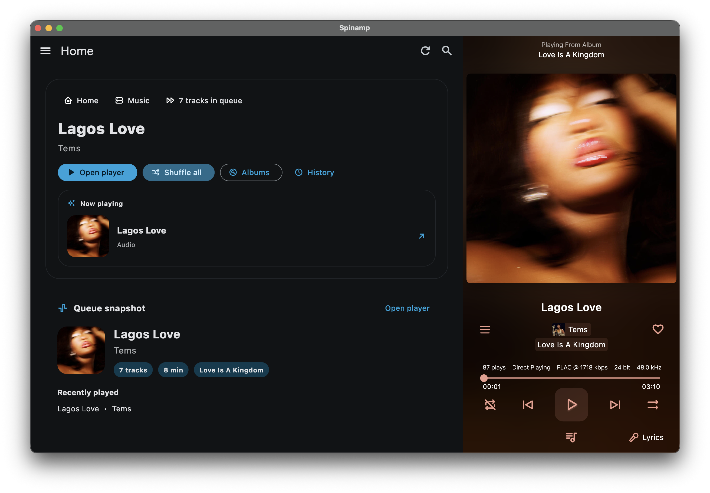

# Spinamp

Spinamp is a desktop-first Jellyfin music player built from the Finamp codebase and reshaped for macOS and Windows.

This fork is focused on:
- a desktop-oriented UI
- direct GitHub Releases distribution
- macOS DMG packaging
- Windows installer packaging

Mobile platforms are not part of this fork's roadmap.

## Project Direction

Spinamp started as a practical fork of Finamp because the original project already had the Jellyfin auth, library, queue, playback, and offline foundations in place. This repo keeps that core, but the active product direction is now different:

- desktop-only
- separate branding
- separate release flow
- separate GitHub repository and release assets

If you need the original mobile-focused app, use the upstream Finamp project instead.

## Supported Platforms

- macOS
- Windows

Current distribution happens through GitHub Releases.

## Downloads

Latest releases:

- macOS: DMG installer
- Windows: EXE installer

Release page:

- https://github.com/sparkserian/spinamp/releases

## Requirements

You need your own Jellyfin server to use Spinamp.

If you do not already have one, start here:

- https://jellyfin.org/

## Current Focus

The active work in this fork is centered on:

- desktop UX polish
- Jellyfin playback and library stability
- offline/download support for desktop
- release automation for macOS and Windows

## Development

Spinamp is a Flutter desktop app.

Useful docs in this repo:

- [CONTRIBUTING.md](./CONTRIBUTING.md)
- [RELEASING.md](./RELEASING.md)
- [MANUAL_RELEASE.md](./MANUAL_RELEASE.md)

## Release Flow

The current release model is:

- macOS builds locally, then uploads a DMG to GitHub Releases
- Windows builds on GitHub Actions, then uploads an EXE installer to GitHub Releases

## Attribution

Spinamp is derived from the Finamp project and still relies on a significant amount of the original application architecture and shared logic.

Original project:

- https://github.com/jmshrv/finamp
